## Hi, I'm Xavier Lau!

- Senior Rust Developer (active since 2015)
- Blockchain Enthusiast (active since 2019)
- Polkadot Fellowship Member
- Cryptocurrency Investor

## Tech Expertise & Interests

### Automation Enthusiast

- Mastering GitHub Actions for CI/CD automation.

### Blockchain Development

- Deep expertise in the Polkadot-SDK ecosystem.
- Specialize in cross-chain bridges.
- Extensive knowledge of the Bitcoin and Ethereum protocols.

### Operating Systems

- Proficient across Linux, macOS, and Windows.

### Gaming & Reverse Engineering

- Data mining using data crawling/analysis.
- Skilled in memory injection techniques.
- Implementing YOLO AI object detection.
- Created a Linux Raspberry Pi Windows mouse driver-driven aimbot.

### Rust Philosophy

- Passionate advocate of Rust’s philosophy, syntax, and ecosystem.
- Committed to implementing solutions in Rust wherever feasible.

## Community Contributions & Projects

### Stack Exchange
- Ranked Top 1 in 2024 & 2025 under the Polkadot-SDK tag, [view my profile](https://substrate.stackexchange.com/users/251/aurevoirxavier).

### Notable Open-Source Projects

- [AiR](https://github.com/hack-ink/AiR): A versatile AI tool built using Rust.
- [array-bytes](https://github.com/hack-ink/array-bytes): A no-std Rust library for handling arrays, bytes, and hex—widely adopted in the Polkadot ecosystem.
- [atomicalsir](https://github.com/hack-ink/atomicalsir): The first-ever Rust-based mining engine for the Bitcoin Atomicals protocol.
- [Subalfred](https://github.com/hack-ink/subalfred): A comprehensive toolbox for Substrate development.
- [unescaper](https://github.com/hack-ink/unescaper): A Rust library for unescaping strings, popular in tools like Starkware's language parser.

Explore more at [hack-ink](https://github.com/hack-ink).

## Metrics

